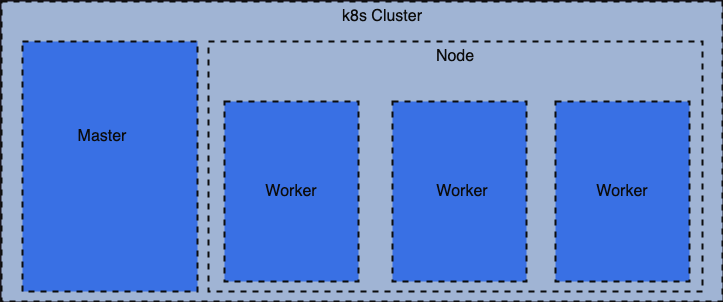

# Kubernetes

## ¿Qué es Kubernetes?
***

## Arquitectura
***
El siguiente diagrama muestra la arquitectura de un cluster de Kubernetes

Un cluster de Kubernetes se divide en 2 componentes principales
* Master: Monitoriza los nodos
* Workers: Son los encargados de alojar los con

## Objetos de Kubernetes

### Pod
***
Es una instancia de una aplicación, es el objeto más pequeño que podemos crear en Kubernetes

## Comandos

## Bibliografía
***
[Documentación Oficial](https://kubernetes.io/es/docs/home/)